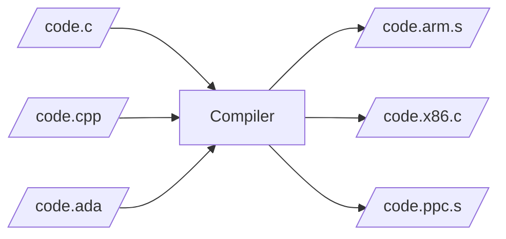
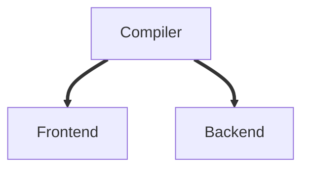

# Overview


Stages:
1. Preprocess;
2. Compile;
2. Assemble;
3. Link.

```bash
$ g++ -O2 main.cpp -o main --verbose
# Run compiler (preprocess + compile)
/usr/lib/gcc/x86_64-linux-gnu/10/cc1plus ...
...
# Run assembler
as -v --64 -o /tmp/cc2E8xQ5.o /tmp/ccAmJux2.s
...
# Run linker
/usr/lib/gcc/x86_64-linux-gnu/10/collect2 ...
...
```

To save temprorary (intermediate files):
```bash
$ g++ -O2 main.cpp -o main --save-temps
```
After you run `g++` with `--save-temps` flag you will receive:
* main.ii - translation unit (source code after preprocess);
* main.s - code after optimizing and assembling for specific platform (architecture);
* main.o - object file (code in ELF format);
* main - executable file (code and runtime library in ELF format).

To go through these stages separately:
- Preprocess source file - `g++ -E <file>.cpp`
- Compile - `g++ -S <file>.cpp`
- Compile and assemble - `g++ -c <file>.cpp`
- All together - `g++ <file>.cpp -o <file>`

## Preprocess

Responsibility:
* insert content to the translation unit when it finds `#include` directive;
* stip out of code (headers) when it `#if` macro whose directive evaluates to false;
* macro replacement.

*hello-world.ii*
```
# 1 "hello-world.cpp"
# 1 "<built-in>"
# 1 "<command-line>"
# 1 "/usr/include/stdc-predef.h" 1 3 4
# 1 "<command-line>" 2
# 1 "hello-world.cpp"
# 1 "/usr/include/c++/9/iostream" 1 3
# 36 "/usr/include/c++/9/iostream" 3
...
```

## Compile

Translate C++ code into assembler instructions:



*hello-world.s*
```asm
    .file    "hello-world.cpp"
    .text
    .section    .rodata
    .type    _ZStL19piecewise_construct, @object
    .size    _ZStL19piecewise_construct, 1
...
    movq    %rax, %rdx
    movq    _ZSt4endlIcSt11char_traitsIcEERSt13basic_ostreamIT_T0_ES6_@GOTPCREL(%rip), %rax
    movq    %rax, %rsi
    movq    %rdx, %rdi
    call    _ZNSolsEPFRSoS_E@PLT
    movl    $0, %eax
...
```

Compiler comes apart into two parts:


Frontend responsibility:
* Preprocessing;
* Lexical analyzing;
* Syntax analyzing (build AST tree);
* Semantic analyzing;
* Build high-level IR.

Backend responsibility:
* Optimize **HIR** (high-level IR);
* Optimize **MIR** (mid-level IR);
* Optimize **LIR** (low-level IR);
* Code generating.

Compiler workflow:


Compiler translate code into IR (intermediate representation) to be able to optimize output for different platforms. There are three different types of IR (high, middle and low). On each level, compiler does specific optimization.

There are three kinds of optimization:
* Optimization 1 - machine-independent optimizations (HIR);
* Optimization 2 - machine-dependent optimizations on virtual registers (MIR);
* Optimization 3 - machine-dependent optimizations on physical registers (LIR).

To be able to see dumps of processing the IR tree do next command:
```bash
$ g++ -O2 -fdump-tree-all code.cpp -c
```
To be able to see dumps of RTL-based (LIR) passes of compiler do next command:
```bash
$ g++ -O2 -fdump-rtl-all code.cpp -c
```

For more information about available options follow the [link](https://gcc.gnu.org/onlinedocs/gcc/).

## Assemble

Responsibility:
* Encode instructions written in assembler language into machine code;
* Compose sections with code and data into object file in binary format (e.g. ELF format);
* Include DWARF (debug) information into object file (if particular option present).

## Link

Responsibility:
* Compose object files into one executable or dynamic library file in binary format (e.g. ELF format);
* Resolve dependencies between different object files (e.g. extern functions);
* Checking for undefined reference errors or one definition rule violations.

**Note:** Static library represents archive of object files and doesn't involve linking as process.

For example:
```bash
$ g++ sum.o print.o main.o -o app.x
```
Will output `app.x` binary executable file.

# Object file

Look at the symbols exported and imported by particular object file:
```bash
$ g++ -c <file>.cpp
$ nm <file>.o
```
Example of output:
```
0000000000000014 T sumF
0000000000000000 T sumI
```
There are two exported symbols and no one was imported.


Another example of output:
```
0000000000000132 T printSumFloat
0000000000000113 T printSumInt
                 U sumF
                 U sumI
0000000000000074 T _Z8printSumff
0000000000000000 T _Z8printSumii
                 U _ZSt4cout
```
From this output we see:

+ `printSumFloat` and `printSumInt` - C++ methods with "C" linkage;
+ `printSum` - C++ overloaded method with mangled name;
+ `sumF`, `sumI` and `std::cout` - methods are undefined by this object file (supposed to be provided in one of the object files or libraries).


To look at symbols and demangle their names:
```bash
$ nm -C <file>.o
```

To look the list of relocations:
```bash
$ readelf -r <file>.o
```