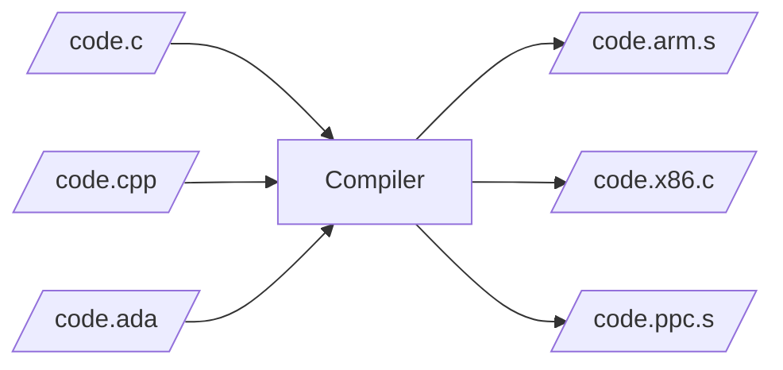
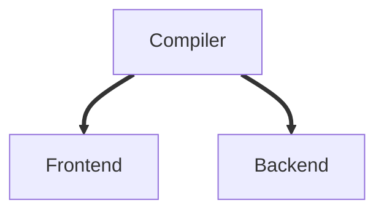

# Overview


Stages:
1. Preprocess;
2. Compile;
2. Assemble;
3. Link.

```bash
$ g++ -O2 main.cpp -o main --verbose
# Run compiler (preprocess + compile)
/usr/lib/gcc/x86_64-linux-gnu/10/cc1plus ...
...
# Run assembler
as -v --64 -o /tmp/cc2E8xQ5.o /tmp/ccAmJux2.s
...
# Run linker
/usr/lib/gcc/x86_64-linux-gnu/10/collect2 ...
...
```

To save temprorary (intermediate files):
```bash
$ g++ -O2 main.cpp -o main --save-temps
```
After you run `g++` with `--save-temps` flag you will receive:
* main.ii - translation unit (source code after preprocess);
* main.s - code after optimizing and assembling for specific platform (architecture);
* main.o - object file (code in ELF format);
* main - executable file (code and runtime library in ELF format).

To do these stages separately:
- Preprocess source file - `g++ -E <file>.cpp`
- Compile - `g++ -S <file>.cpp`
- Compile and assemble - `g++ -c <file>.cpp`
- All together - `g++ <file>.cpp -o <file>`

## Preprocess

While parsing C++ source file, the preprocessor will build a translation unit by inserting content in it when it finds an `#include` directive at the same time it'll stip out of code and the headers when it find conditional compilation blocks (`#if` macro clause) whose directive evaluates to `false`. At the same time it'll do some other tasks like macro replacement.

*hello-world.ii*
```
# 1 "hello-world.cpp"
# 1 "<built-in>"
# 1 "<command-line>"
# 1 "/usr/include/stdc-predef.h" 1 3 4
# 1 "<command-line>" 2
# 1 "hello-world.cpp"
# 1 "/usr/include/c++/9/iostream" 1 3
# 36 "/usr/include/c++/9/iostream" 3
...
```

## Compile

### Overview

Translate C++ code into assembler instructions:



*hello-world.s*
```asm
	.file	"hello-world.cpp"
	.text
	.section	.rodata
	.type	_ZStL19piecewise_construct, @object
	.size	_ZStL19piecewise_construct, 1
...
	movq	%rax, %rdx
	movq	_ZSt4endlIcSt11char_traitsIcEERSt13basic_ostreamIT_T0_ES6_@GOTPCREL(%rip), %rax
	movq	%rax, %rsi
	movq	%rdx, %rdi
	call	_ZNSolsEPFRSoS_E@PLT
	movl	$0, %eax
...
```

### Details

Compiler comes apart into two parts:

Frontend responsibilities:
* Preprocessing;
* Lexical analyzing;
* Syntax analyzing (build AST tree);
* Semantic analyzing;
* Build high-level IR.

Backend responsibilities:
* Optimize **HIR** (high-level IR);
* Optimize **MIR** (mid-level IR);
* Optimize **LIR** (low-level IR);
* Code generating.


Compiler translate code into IR (intermediate representation) to be able to optimize output for different platforms. There are three different types of IR (high, middle and low). On each level, compiler does specific optimization.

There are three kinds of optimization:
* Optimization 1 - machine-independent optimizations;
* Optimization 2 - machine-dependent optimizations on virtual registers;
* Optimization 3 - machine-dependent optimizations on physical registers.

## Assemble

Translate assembler instructions to machine code.

## Link

Combine object files into one binary file.

For example:
```bash
$ g++ -o c-app sum.o print.o c-main.o
```
Will output `c-app` binary executable file.

# Object file

Look at the symbols exported and imported by particular object file:
```bash
$ g++ -c <file>.cpp
$ nm <file>.o
```
Example of output:
```
0000000000000014 T sumF
0000000000000000 T sumI
```
There are two exported symbols and no one was imported.


Another example of output:
```
0000000000000132 T printSumFloat
0000000000000113 T printSumInt
                 U sumF
                 U sumI
0000000000000074 T _Z8printSumff
0000000000000000 T _Z8printSumii
                 U _ZSt4cout
```
From this output we see:

+ `printSumFloat` and `printSumInt` - C++ methods with "C" linkage;
+ `printSum` - C++ overloaded method with mangled name;
+ `sumF`, `sumI` and `std::cout` - methods are undefined by this object file (supposed to be provided in one of the object files or libraries).


To look at symbols and demangle their names:
```bash
$ nm -C <file>.o
```

